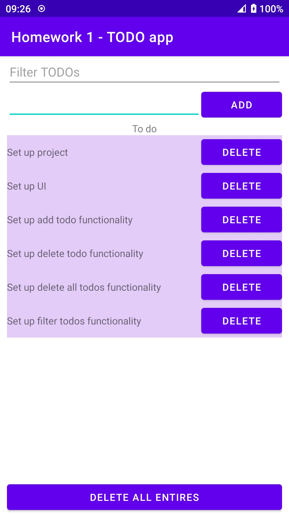

# Homework 1

Building UI using basic widgets(buttons and textViews) and layout managers such as LinearLayout

# Functionality

The UI layout is given some functionality as a simple TODO app.

The first editText is used to filter TODO entries.

The second editText and button are used to add new TODO entry.

The scrollView is used to display TODOS along with a button to delete an entry.

The bottom button is used to delete all TODO entries.

# Screenshots

