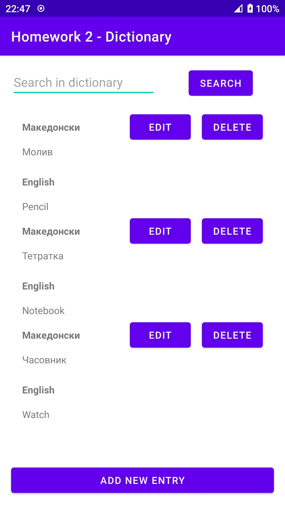
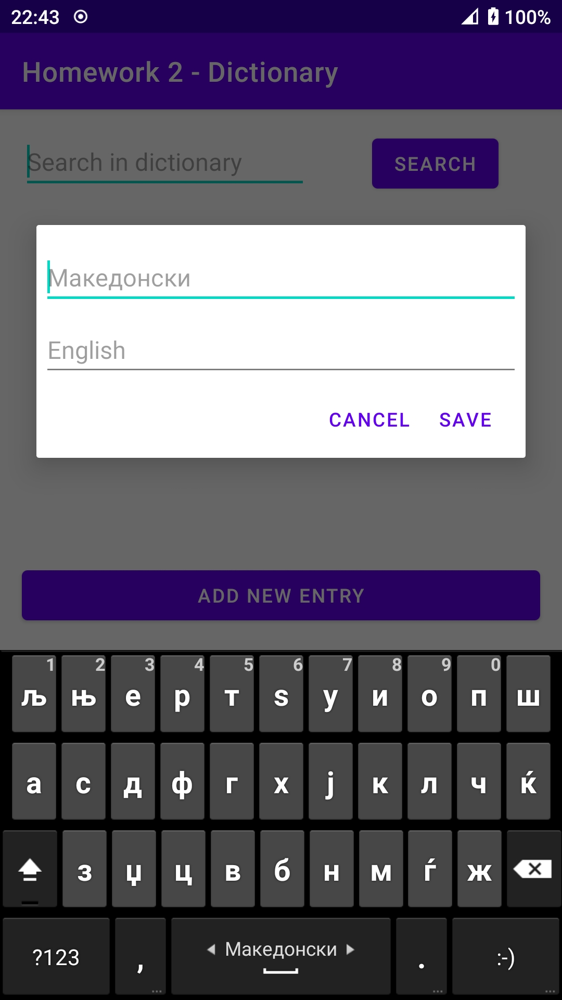
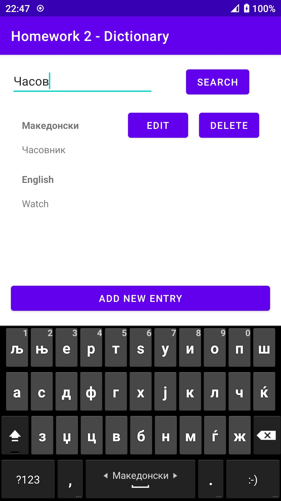

# Homework 2

Goal of the homework is to implement simple dictionary(macedonian to english)
and utilize file storage to save the dictionary.

# Functionality

The homework includes functionality for:

* adding new dictionary entry
* editing dictionary entry
* deleting dictionary entry
* searching through dictionary entries
* storage support

# Bonus features

One bonus feature is deleting dictionary entry.

Another bonus feature is using dialogs to add or edit dictionary entries.

# Screenshots

* Main activity

* Adding new dictionary entry

* Searching through dictionary entries
